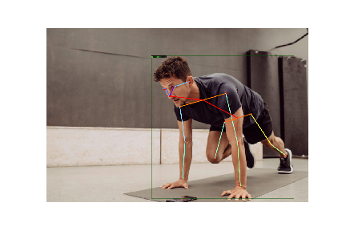
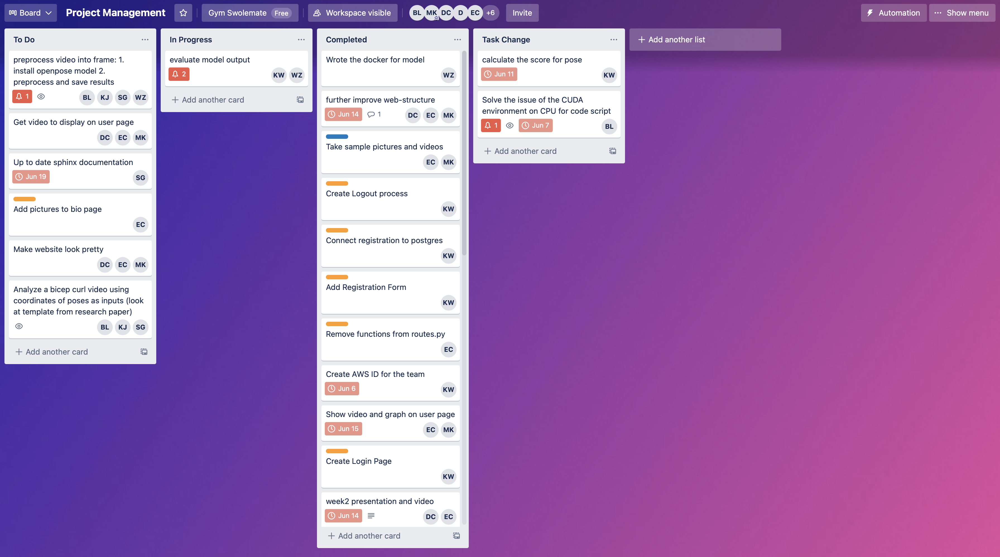
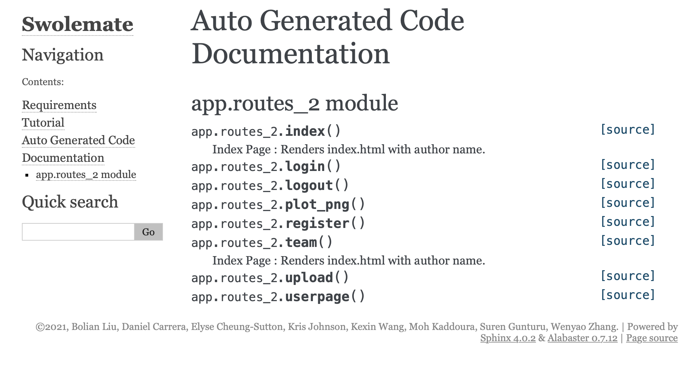

# Swolemate
*Final project of Product Analytics, USF MSDS program*

# About

*Providing Hollywood level training in the comfort of your home*

**CEO**: [Kexin Wang](https://www.linkedin.com/in/sheena-kexin-wang-3a51b7170/)  
**CTO**: [Daniel Carrera](https://www.linkedin.com/in/daniel-carrera/)  
**Data Scientist**:  [Elyse Cheung-Sutton](https://www.linkedin.com/in/elysecs), [Moh Kaddoura](https://www.linkedin.com/in/moh-kaddoura/)  
**Engineer**: [Boliang Liu](https://www.linkedin.com/in/boliang-liu/), [Kristofor Johnson](https://www.linkedin.com/in/kr-johnson/),
              [Suren Gunturu](https://www.linkedin.com/in/suren-gunturu/), [Wenyao Zhang](https://www.linkedin.com/in/wenyao-zhang/)  

   

# Technical Components

## Model

We used Detectron2, which is developed by Facebook AI Research, to detect the movements of human joint points in vedios. And We used the outputs of pose estimation to evaluate videos of professional trainers and users through human pose keypoints. In this project, we evaluated three exercises: bicep curl, front raise, and shoulder press.

References:  
https://github.com/facebookresearch/detectron2  
https://github.com/stevenzchen/pose-trainer

## Trello Project Management 

We used project management tool Trello to track tasks and progress.

## Sphinx

We used Python documentation generation tool to generate document.

## Docker   

## Elastic Beanstalk   

We used AWS Elastic Beanstalk to deploy our application, so it's easy to scale and update based on user growth.
